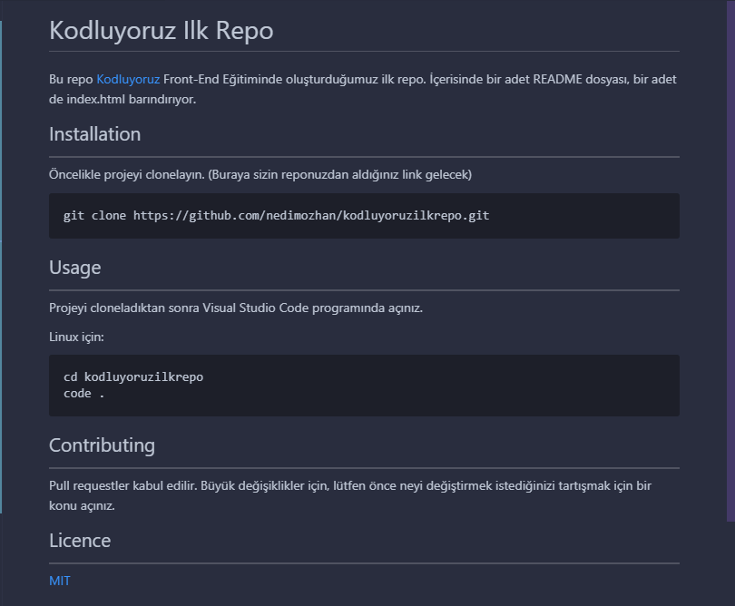

# Kodluyoruz Ilk Repo

Bu repo [Kodluyoruz](https://www.kodluyoruz.org/) Front-End Eğitiminde oluşturduğumuz ilk repo. İçerisinde bir adet README dosyası, bir adet de index.html barındırıyor.


.png "Text to show on mouseover")




## Installation
-----------------------
Öncelikle projeyi clonelayın. (Buraya sizin reponuzdan aldığınız link gelecek)

```
git clone https://github.com/nedimozhan/kodluyoruzilkrepo.git
```


## Usage 
---------------------
Projeyi cloneladıktan sonra Visual Studio Code programında açınız.

Linux için:

```2
cd kodluyoruzilkrepo
code .
```


## Contributing
----------------------
Pull requestler kabul edilir. Büyük değişiklikler için, lütfen önce neyi değiştirmek istediğinizi tartışmak için bir konu açınız.

## Licence
-------------------------
[MIT](https://choosealicense.com/licenses/mit/)